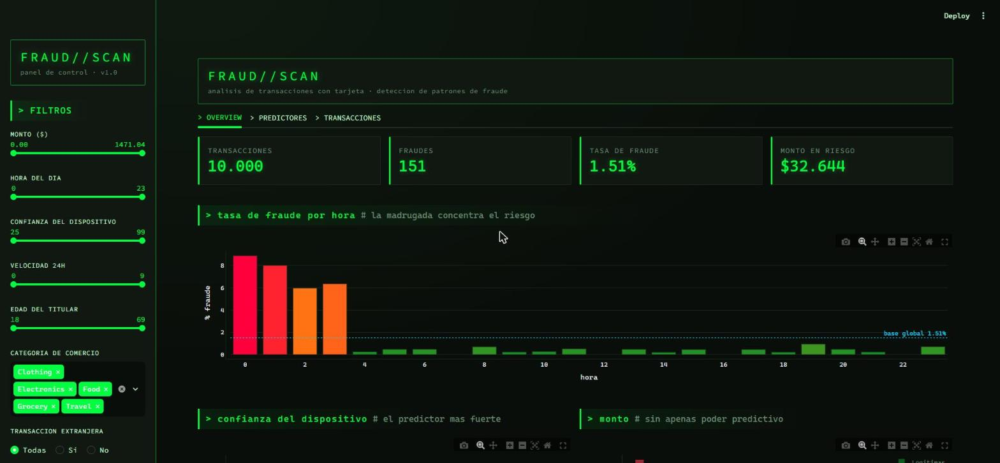
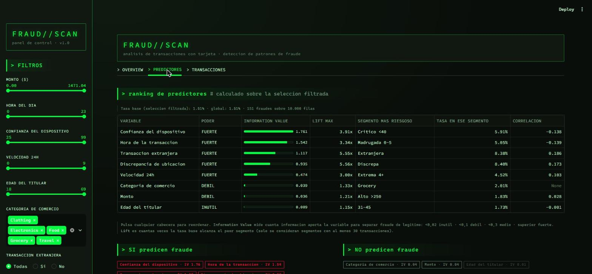
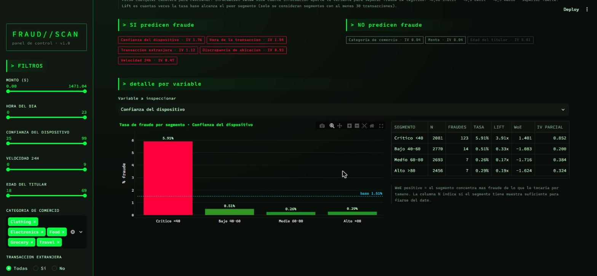
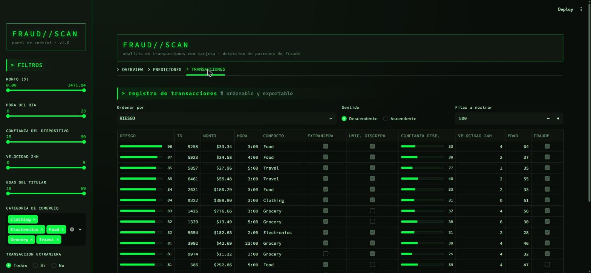

# FRAUD//SCAN

Dashboard en Streamlit para analizar fraude con tarjeta de credito e identificar **que
caracteristicas lo predicen**. Estetica de terminal, analitica en pandas puro.



## El hallazgo

Sobre 10.000 transacciones con 151 fraudes (tasa base **1,51 %**), de las 8 variables
disponibles **5 predicen fraude y 3 no aportan nada**. La separacion no es gradual: hay un
salto de un orden de magnitud entre la quinta y la sexta.

| Variable | IV | Poder | Segmento mas riesgoso | Tasa | Lift |
|---|---|---|---|---|---|
| `device_trust_score` | 1,761 | FUERTE | Critico <40 | 5,91 % | 3,91x |
| `transaction_hour` | 1,542 | FUERTE | Madrugada 0-5 | 5,05 % | 3,34x |
| `foreign_transaction` | 1,117 | FUERTE | Extranjera | 8,38 % | 5,55x |
| `location_mismatch` | 0,935 | FUERTE | Discrepa | 8,40 % | 5,56x |
| `velocity_last_24h` | 0,474 | FUERTE | Extrema 4+ | 4,52 % | 3,00x |
| `merchant_category` | 0,039 | DEBIL | Grocery | 2,01 % | 1,33x |
| `amount` | 0,036 | DEBIL | Alto >250 | 1,83 % | 1,21x |
| `cardholder_age` | 0,009 | INUTIL | 31-45 | 1,73 % | 1,15x |

El fraude de este dataset tiene una firma reconocible: ocurre **de madrugada**, desde un
**dispositivo poco fiable**, a menudo **desde el extranjero** o con la **ubicacion
descuadrada**, y en **rafagas de transacciones**. Ni el importe, ni la edad del titular, ni el
tipo de comercio lo caracterizan - y ese resultado negativo evita construir reglas inutiles.

## Instalacion

```powershell
python -m venv .venv
.\.venv\Scripts\python -m pip install -r requirements.txt
.\.venv\Scripts\streamlit run app.py
```

Comprobar la analitica sin levantar la UI:

```powershell
.\.venv\Scripts\python test_fraud_stats.py
```

## Las tres pestanas

### OVERVIEW
KPIs, tasa de fraude por hora contra la linea de base, confianza del dispositivo y
distribucion de montos (donde se ve que fraude y legitimas se solapan casi por completo).

### PREDICTORES
El ranking por Information Value, ordenable por cualquier columna, y el contraste explicito
entre lo que predice y lo que no.



Cada variable se puede abrir en detalle, con su tabla WoE completa. La columna N permite
juzgar si un segmento tiene muestra suficiente para fiarse del dato:



### TRANSACCIONES
El registro con una columna RIESGO calculada por scorecard WoE. Ordenando por riesgo
descendente, **11 de las 12 primeras transacciones son fraude real** - sin entrenar ningun
modelo, solo sumando pesos derivados de conteos:



## Metodologia

Estadistica clasica de scoring de riesgo, sin modelo entrenado: cada numero se puede rastrear
hasta una tabla de conteos.

- **Lift** = `tasa(segmento) / tasa_base`. Siempre contra la base, para que las variables sean
  comparables entre si.
- **WoE** = `ln( %fraude(bin) / %legitimas(bin) )`. Positivo = concentra mas fraude del que le
  tocaria por tamano.
- **IV** = `SUM( (%fraude - %legitimas) * WoE )`. Umbrales: <0,02 inutil, <0,1 debil,
  <0,3 medio, superior fuerte.

Tres decisiones que importan:

1. **Correccion de Haldane-Anscombe (+0,5)** en los conteos. No es cosmetica: con 151 fraudes
   hay segmentos con cero y `ln(0)` romperia el calculo.
2. **Cortes de negocio, no cuartiles.** `velocity` solo toma valores 0-9 y `hour` 0-23, donde
   `qcut` da segmentos desbalanceados. Los umbrales estan fijados a mano en `BIN_SPEC`.
3. **Minimo de 30 transacciones por segmento** en el ranking. Sin el, un segmento de 3 filas
   con 1 fraude daria un lift de 22x por azar y encabezaria la tabla.

> **Nota sobre los IV altos.** En datos reales un IV > 0,5 es sospechoso de fuga de
> informacion. Aqui cinco variables lo superan porque **el dataset es sintetico y se genero
> aplicando estas mismas reglas**. Sobre transacciones reales no se verian separaciones tan
> limpias.

### La guarda contra filtros enganosos

Si se filtra a "Solo fraude", la tasa base pasa a 100 % y todo lift vale 1,00 - un numero que
parece valido y no significa nada. `es_fiable()` detecta ese caso (y el simetrico, y el de
menos de 30 fraudes) y el dashboard muestra un aviso en vez de la tabla. La casilla *calcular
predictores sobre el dataset completo* permite seguir viendo el ranking global mientras se
explora un subconjunto pequeno.

## Estructura

| Archivo | Que hace |
|---|---|
| `app.py` | Interfaz: filtros, 3 pestanas, tablas |
| `fraud_stats.py` | Analitica en pandas puro, sin Streamlit |
| `theme.py` | Paleta, CSS y layout de Plotly |
| `test_fraud_stats.py` | Asserts contra cifras verificadas a mano |
| `notas/` | Documentacion del analisis en formato Obsidian |
| `credit_card_fraud_10k.csv` | Datos sinteticos, 10.000 filas |

`fraud_stats.py` no importa Streamlit a proposito: permite testear la analitica sin levantar
la UI.

El CSS de `theme.py` usa solo selectores `data-testid`, que son contrato estable de Streamlit;
las clases `.st-emotion-cache-*` son hashes que cambian en cada version.

## Entorno verificado

Python 3.14.6 · Streamlit 1.63.0 · pandas 3.0.5 · Plotly 7.0.0
